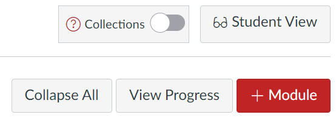
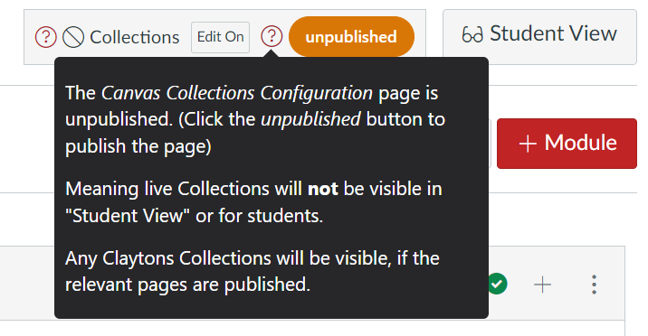

# Visibility - Live Collections

Who is able to see and use Collections in its live form depends on two elements:
1. Whether Collections has been turned on for the course.
1. Whether the Collections Configuration page is published.
2. Collections' visibility setting; and,

!!! warning 

     Students can't use Collections if the configuration page is not published.
     
=== "Off or on"

     Collections is optional. It is not available by default. It must be turned on (and configured) by a teacher/designer before it can be used.

     If Collections is turned off, then students will see the vanilla Canvas modules view. Teachers/designers will see a limited Collections configuration element with an option to turn Collections on.

     <figure markdown>
     <figcaption>Collections is turned off</figcaption>
       
     </figure>

=== "Published or unpublished"

     As per standard Canvas practice, [unpublished pages are invisible to students](https://community.canvaslms.com/t5/Instructor-Guide/How-do-I-publish-or-unpublish-a-page-as-an-instructor/ta-p/592). If the _Canvas Collections Configuration_ page is unpublished, then students are unable to interact with Canvas Collections. 
     
     This also applies to teacher/designer roles when [using _Student View_](https://community.canvaslms.com/t5/Instructor-Guide/How-do-I-view-a-course-as-a-test-student-using-Student-View/ta-p/1122).

     When you first turn on Collections, the configuration file is unpublished. You will need to publish it before students can use Collections. The Collections element will remind you if the configuration page is unpublished. You can click on the _unpublished_ button to open the configuration page in a new browser tab and publish it.

     <figure markdown>
     <figcaption>Collections when first turned on, with an unpublished configuration page</figcaption>
       
     </figure>

=== "Visibility settings"

     ### Visibility settings

     Collections visibility setting controls who is able to see the changes Collections makes to the Modules page. There are four settings.

     | Visibility setting | Description |
     | ------------------ | ----------- |
     | none | 
No one can see the changes Collections makes to the Modules page.
 
Teachers/designers are still able to see the Collections configuration element. They can also use that element to configure Collections
 |
     | students | 
Students can see the changes Collections makes to the Modules page. Teachers/designers cannot see those changes.

 Teachers/designers are still able to see the Collections configuration element and use it to configure Collections |
     | teachers | 
Students can not see Collections' changes.
 
Teachers/designers can and they can use the Collections configuration element to configure Collections
 
 <em>Default setting:</em> When Collections is first turned on, visibility is set to <em>teachers</em>.|
     | all | 
Everyone can see Collections' changes.
 
Teachers/designers can use the Collections configuration element to configure Collections
 |

     <figure markdown>
     <figcaption>Using Collection's Visibility settings</figcaption>
     <sl-animated-image
          src="../images/visibility.gif"
     	 alt="Demonstration of changing the visibility setting"></sl-animated-image>
     </figure>

<link rel="stylesheet" href="https://cdn.jsdelivr.net/npm/@shoelace-style/shoelace@2.0.0/dist/themes/light.css" />

**************** OLD STUFF BELOW ****************

### Published or unpublished

Canvas Collections configuration information (e.g. what are the collections for your course, which modules belong to which collections etc.) are stored in your Canvas course in the Canvas page titled _Canvas Collections Configuration_.  

As per standard Canvas practice, [unpublished pages are invisible to students](https://community.canvaslms.com/t5/Instructor-Guide/How-do-I-publish-or-unpublish-a-page-as-an-instructor/ta-p/592). If the _Canvas Collections Configuration_ page is unpublished, then students are unable to interact with Canvas Collections and they will see the vanilla Canvas modules view. This also applies to teacher/designer roles when [using _Student View_](https://community.canvaslms.com/t5/Instructor-Guide/How-do-I-view-a-course-as-a-test-student-using-Student-View/ta-p/1122).

If the _Canvas Collections Configuration_ page is unpublished an _Unpublished_ warning will appear next to the Canvas Collections box - as shown in the following image.

  

Hover your mouse over the question mark icon in the _Unpublished_ warning to see an explanatory message, but also access a link to the configuration page. Click that link and the page will open in a new browser, ready for you to publish it.

After publishing the configuration page, you will need to reload/refresh the Modules view for Collections to remove the _Unpublished_ warning.

  

### The admin role difference

[Admin roles](https://community.canvaslms.com/t5/Canvas-Basics-Guide/What-is-the-Admin-role/ta-p/78) are a different type of Canvas user role. Admin roles can access a course site without having either a teacher/designer or student role in the course. Admin roles will not be included on [the _People_ page](https://community.canvaslms.com/t5/Instructor-Guide/How-do-I-use-the-People-page-in-a-course-as-an-instructor/ta-p/667).

In terms of Canvas Collections' sets of interaction functionality, Admin roles can (regardless of on, off, or unpublished):

1. Configure - will not be able to configure Canvas Collections
2. Interact - will be able to interact with Canvas Collections

In order to configure Canvas Collections a person with an admin role must be given a teacher or designer role with the course.