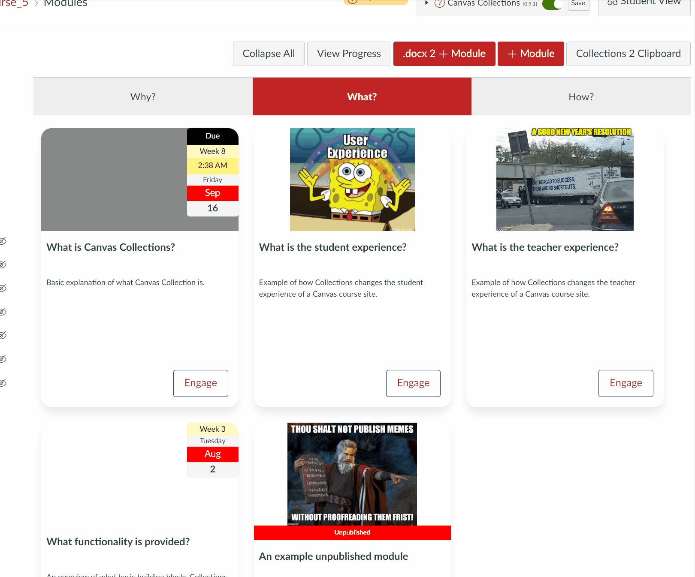

# Objects (aka Activities)

Vanilla Canvas modules can only provide the information and functionality provided by vanilla Canvas. Design (e.g. that the module is a lecture or assessment) and context specific (e.g. the date it is due) information can be added to the module name. But this is limited and manual.

A key feature of Collections is the ability to specify additional metadata and functionality for Canvas modules as a way to transform them into design and context specific objects. To better support and visually express your course's learning design.

## Description

A description of the object that will be displayed in most representations to provide students with a way to answer what, why, how or some other question about the module. How (and perhaps if) the description is shown to the student will depend on the relevant collection's representation.

## Banner

The card design for Collection's cards representation uses the idea of a banner as the top part of the card (i.e. the top section of the card circled in red in the following image). Typically used to provide a visual representation of the module, contributing to the overall visual design of the course, and possibly helping students build conceptual associations. 

As illustrated in the following image, there are three common types of banner:

1. Image - the URL of an image is provided and is displayed in the banner.

    By default, the banner is set to a default image.
2. Iframe - an iframe (aka HTML embed code) - e.g. a YouTube embed.

    (The second card in the image below has a YouTube video banner which is currently not displaying)
3. Colour - the banner background is set to a single colour.

  

### Configuring the banner

You are able to configure 0 or more of the banner options. By default, a new module will be configured to use a placeholder image. The banner option that is current visible in the module configuration area will be the option used on the matching card - as illustrated in the following animated image.

!!! note "Some representations ignore the banner options"

    Currently, on the _Griffith Cards_ representation actively uses the banner options.

The following animated image steps through the following:

1. Showing a card representation of a module (using an iframe banner) and its corresponding configuration.
2. Illustrates how when the current banner choice is changed from image to iframe to colour how the card representation changes to match.


### Image

Images are specified by two pieces of metadata:

1. Image url - the web location where the image can be viewed.
2. Image scale - how the image should be scaled to fit within the available space.

#### Image url

Designed to contain either:

1. The URL for an image to be displayed.

    See the [Image URL](../../../walk-throughs/new/configure-modules/#image-url) section of the [Configure Modules walk-through](../../../walk-throughs/new/configure-modules) for more information, including demonstration of how to get the URL of an image in the Canvas files area.

2. The embed code for [an iframe](https://www.hostinger.com/tutorials/what-is-iframe/) (e.g. a YouTube/Vimeo/Stream/Studio etc video)

    Copy and paste the full embed code from a video-hosting (or some other) service and it will be embedded where the image would normally appear.

#### Image scale

For an iframe, _Image Scale_ is ignored. Instead, iframes are automatically set to use ```width="100%" height="100%"``` to ensure they are scaled to fit the available space.

For an image, _Image scale_ modifies the scaling of the image using the standard [CSS property called object-fit](https://www.w3schools.com/cssref/css3_pr_object-fit.asp). The following table outlines the possible values for object-fit. These values appear in the Image scale drop down when configuring a module. 

See the [Image Scale](../../../walk-throughs/new/configure-modules/#image-scale) section of the [Configure Modules walk-through](../../../walk-throughs/new/configure-modules) for more information, including an animation of the impact of the different values.


| Value | 	Description |
| --- | --- |
| cover |	The image is scaled to fit the available space, maintaining the aspect ratio. The image is cropped to fit the available space. |
| contain | 	The image is scaled to fit the available space, maintaining the aspect ratio. The image is not cropped. |
| fill |	The image is scaled to fill the available space, maintaining the aspect ratio. The image is cropped to fit the available space. |
| fit |	The image is scaled to fit the available space, maintaining the aspect ratio. The image is not cropped. |
| none |	The image is not scaled. |
| scale-down | 	The image is scaled to fit the available space, maintaining the aspect ratio. The image is not cropped. |

### Iframe

The iframe banner option allows you to copy and paste a [HTML iframe element](https://developer.mozilla.org/en-US/docs/Web/HTML/Element/iframe). Meaning you're able to embed other web content such as another web page, but more commonly a video (e.g. from YouTube or Studio). Collections will perform some checks on the iframe code and will modify it to work within the context of a card.

The following animated image demonstrates the process of using the iframe banner option. Before starting, a [public embed code (aka iframe) for a Canvas Studio video](https://community.canvaslms.com/t5/Studio/How-do-I-get-a-public-link-or-embed-code-for-media-in-Canvas/ta-p/1712) was created and then copied into the clipboard. The image shows the process from there, including:

1. Moving to the Module's configuration area.
2. Opening the _banner_ section and moving to the _iframe_ option.
3. Pasting the video iframe code into the available text area and resizing the text area to better see the code.
4. Reading the alert box Collections generates when it detects a change in the iframe code.
5. A return to the module to view the video and press play.



### Colour

The colour banner option allows you to choose a fixed colour for the banner. This has proven useful in situations where a module represents a topic/purposes for which no photo or video is available or suitable. The colour is chosen using a colour picker - as demonstrated in the following animated image.


## FYI

A way to specify that a module should become a _For Your Information_ (FYI) only object. i.e. any representation will only display Collections' information (label, number, description, banner etc). It should not display any information about the actual Canvas module, including a link to the module.

FYI object's - since they don't display any information about the Canvas module - are always displayed. Regardless of whether the module is unpublished or generally not available to the student.


## Labels and Numbers

Many course designs use modules to represent common objects (e.g. lectures, tutorials, workshops, assessments, themes, topics etc.). Often a course will have multiple such objects (e.g. topic 1, topic 2, topic 3). Labels and numbers provide a means to explicitly identify such objects and their sequence. This information is used in different ways by each representation.

Collections provides the ability for you to explicitly specify the number for each module OR it can auto calculate the number based on the module's position in the collection.

## Dates

Collections allows you to specify the date, time, or date/time range. In a University context, such dates are typically given with reference to a given study period (aka semester, trimester, study session etc.). For example, Monday Week 1 of Trimester 1 will be a different date for Monday Week 1 of Trimester 2.

This commonly leads to two strategies:

1. Generic dates - specify the date in a study period independent way (e.g. "Week 1", "Week 2", "Week 3" etc.). No upkeep is required, but students are expected to translate the generic dates into specific calendar dates.
2. Specific dates - specify the actual calendar date (e.g. 1st March). Requires manual updating each study period, but students can easily see the specific date.

Collections can take on the task of translating generic dates into calendar specific dates. It identifies the study period for the current course site and translates a generic date into the appropriate specific date based on the institution's academic calendar.

!!! Note "Dates is workable, but under construction"

    :construction: Currently, dates can only be specified using generic dates and Griffith University study periods.

### Study Period

At Griffith University, the course code typically includes a term code. A four digital number identifying the study (aka teaching) period.  Collections attempts to extract the term code from the course code, which is then used to map generic dates to specific calendar dates. If the term code cannot be extracted, Collections defaults to the current study period.

See [the Griffith course id explanation page](https://intranet.secure.griffith.edu.au/computing/using-learning-at-griffith/staff/administration/course-ID) for more information about term codes.

Collections will display the label - circled in red in the following image - for the study period it is using to generate calendar dates.

  


### Date types

As summarised in the following table, the date area of the Module configuration dialog allows you to specify dates for three different purposes.

!!! info "'Coming Soon' is coming soon"

    :construction: The 'Coming Soon' feature is still a work in progress.

| Date type | Purpose |
| --- | --- |
| Start Date | Either a one-off date or the start date of a date range |
| Stop Date | The end date of a date range |
| Coming Soon | :construction: A date indicating when a module will become available to students |

All three date types are available from the same space via a tabbed interface. As illustrated by the following animated image, each date type provides a similar (but not the same) interface.


### Start Date

Start date can specify either a one-off date or the start of a date range. The following table summarises the values you can specify for a start date.

| Value | Default value | Description |
| --- | --- | --- |
| Date label | Commencing | A text label that will be added before the date (range). e.g. "Starts" or "Due".
| Day of week | _Not Chosen_ | The full name of the day of the week for the date |
| Week | _Not Chosen_ | The number of the week within the study period in which the date occurs. |
| Time | | The time of day (if any) for the date. |

### Stop Date

Stop date specifies the final date in a date range. A stop date can be assigned all of the same values as a Start date (see previous table), except for the Date label.

### Representation of dates

How dates are displayed to the student depends on the combination of:

1. The design of the current representation for a collection.
2. What dates have been configured.

The following animated image demonstrates how the representation of a date changes through the following stages:

1. No date has been configured for the cards representation.
2. A start date is partially and then fully configured.
3. The representation is changed to the assessment table representation and then back to the cards.
4. A stop date is partially and then almost fully configured (the week is not specified, hence no final date).


### Coming Soon

!!! Note "Coming Soon is under construction"

    :construction_site: The "Coming Soon" feature is currently being developed. It will be an adaptation of the [Card Interface "Coming Soon" feature](https://djplaner.github.io/Card-Interface-Tweak/customiseACard/#making-a-coming-soon-card) for Canvas.

## Additional Metadata

For various reasons you may wish to provide additional metadata about a module. The _additional metadata_ area enables this. You can add (and delete) any additional metadata in the form of name/value pairs.