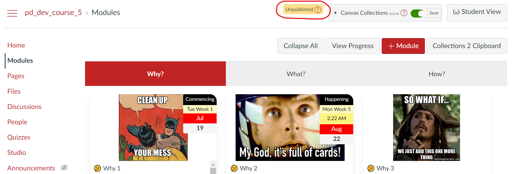
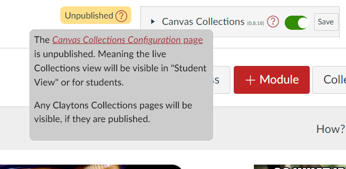

# On, off, and unpublished

Whether Canvas Collections is _on_, _off_, and/or _unpublished_ influence who is able to configure and interact with Collections will change. This is also dependent on whether its [_live_](../getting-started/use/live.md) or [_Claytons_](../getting-started/use/clatyons.md) collections.

## Claytons Collections

Claytons Collections generates static Canvas pages containing representations of collections. Once these pages are created, viewing them does not use Canvas Collections. Consequently, the _on_, _off_, and _unpublished_ settings do not influence Claytons Collections.

Instead, the question is whether the Canvas pages containing the collection representations have been published. As per standard Canvas practice, [unpublished pages are invisible to students](https://community.canvaslms.com/t5/Instructor-Guide/How-do-I-publish-or-unpublish-a-page-as-an-instructor/ta-p/592)

## Live Collections

Live Collections is when you are interacting "live" with the Canvas Collections code. The code is installed either [individually](../getting-started/install/individual.md) or [institutionally](../getting-started/install/institutional.md). Canvas Collections provides two sets of interaction functionality:

1. Configure - teacher/designer roles are potentially able to modify how Canvas Collections is configure.
2. Interact - all roles are potentially able to use Canvas Collections to navigate a modified view of the Canvas course's modules.

Whether you can use these functionality sets depends on the _on_, _off_, and _unpublished_ settings. The following table summarises with more detail following

| On/Off | Published/Unpublished | Configuring | Interacting |
| --- | --- | --- | --- |
| On | Published | Teacher/designer roles are able to configure | All roles are able to interact|
| On | Unpublished | Teacher/designer roles are able to configure  | Teacher/designer roles are able to interact. Students can NOT interact, they will see the vanilla Canvas modules view.|
| Off | Published | Teacher/designer roles can only turn Collections on. | All roles see the vanilla Canvas modules view |
| Off | Unpublished | Teacher/designer roles can only turn Collections on. | All roles see the vanilla Canvas modules view |

> ❗ **Note:** As explained below, admin roles are [treated slightly differently](#the-admin-role-difference)

## What you see and can do?

Exactly what you see in the various states depends - as mentioned above - on your role in the course. The following provides screenshots and descriptions of these differences.

### On or off

If Canvas Collections is installed, teacher/designer roles will always be able to see the Canvas Collections box at the top of the Canvas modules view. A part of this box is the _on_ or _off_ toggle. The following image has the Canvas Collections box circled in red. The toggle is turned off and thus the rest of the page shows the vanilla Canvas modules view.

  

Click the toggle and Canvas Collections will turn on. The following image shows the same Canvas modules view, but this time the toggle (and collections) is turned on.

  

### Published or unpublished

Canvas Collections configuration information (e.g. what are the collections for your course, which modules belong to which collections etc.) are stored in your Canvas course in the Canvas page titled _Canvas Collections Configuration_.  

As per standard Canvas practice, [unpublished pages are invisible to students](https://community.canvaslms.com/t5/Instructor-Guide/How-do-I-publish-or-unpublish-a-page-as-an-instructor/ta-p/592). If the _Canvas Collections Configuration_ page is unpublished, then students are unable to interact with Canvas Collections and they will see the vanilla Canvas modules view. This also applies to teacher/designer roles when [using _Student View_](https://community.canvaslms.com/t5/Instructor-Guide/How-do-I-view-a-course-as-a-test-student-using-Student-View/ta-p/1122).

If the _Canvas Collections Configuration_ page is unpublished an _Unpublished_ warning will appear next to the Canvas Collections box - as shown in the following image.

  

Hover your mouse over the question mark icon in the _Unpublished_ warning to see an explanatory message, but also access a link to the configuration page. Click that link and the page will open in a new browser, ready for you to publish it.

After publishing the configuration page, you will need to reload/refresh the Modules view for Collections to remove the _Unpublished_ warning.

  

### The admin role difference

[Admin roles](https://community.canvaslms.com/t5/Canvas-Basics-Guide/What-is-the-Admin-role/ta-p/78) are a different type of Canvas user role. Admin roles can access a course site without having either a teacher/designer or student role in the course. Admin roles will not be included on [the _People_ page](https://community.canvaslms.com/t5/Instructor-Guide/How-do-I-use-the-People-page-in-a-course-as-an-instructor/ta-p/667).

In terms of Canvas Collections' sets of interaction functionality, Admin roles can (regardless of on, off, or unpublished):

1. Configure - will not be able to configure Canvas Collections
2. Interact - will be able to interact with Canvas Collections

In order to configure Canvas Collections a person with an admin role must be given a teacher or designer role with the course.