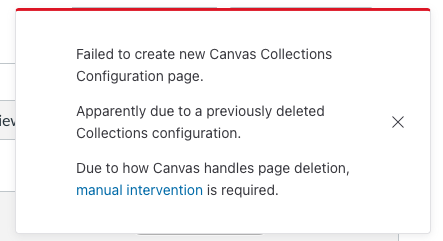
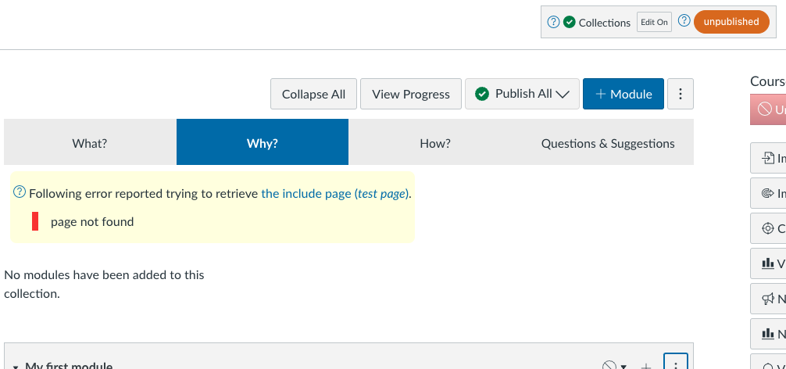

<!--
 Copyright (C) 2024 David Jones
 
 This file is part of Canvas Collections.
 
 Canvas Collections is free software: you can redistribute it and/or modify
 it under the terms of the GNU General Public License as published by
 the Free Software Foundation, either version 3 of the License, or
 (at your option) any later version.
 
 Canvas Collections is distributed in the hope that it will be useful,
 but WITHOUT ANY WARRANTY; without even the implied warranty of
 MERCHANTABILITY or FITNESS FOR A PARTICULAR PURPOSE.  See the
 GNU General Public License for more details.
 
 You should have received a copy of the GNU General Public License
 along with Canvas Collections.  If not, see <https://www.gnu.org/licenses/>.
-->

# Previously deleted configuration page

## Symptom 

When you try to turn Collections on for a course you see a dialog similar to the following image. In addition, you will be unable to turn Collections on.

<figure markdown>
<figcaption>The "Previously deleted configuration page" dialogue</figcaption>

</figure>

## Explanation

In September, 2013 Instructure introduced changes to [how page titles and URLs operate](https://community.canvaslms.com/t5/Canvas-Releases/Canvas-Release-Notes-2023-09-16/ta-p/577167#toc-hId-1051913398). Quite useful changes in general, but problematic for Canvas Collections.

These changes means that even when you delete a Canvas page, Canvas will remember that it existed. 

For example, the very first time you create a page titled "Canvas Collections Configuration", it will have the URL _https://<your_canvas_instance>/courses/<course_id>/pages/canvas-collections-configuration_. If you delete that page and create a new page with the same title, the URL will be _https://<your_canvas_instance>/courses/<course_id>/pages/canvas-collections-configuration-2_.

!!! warning "Collections can only work with the original"

    Collections can only work with a configuration page with the page URL _.../pages/canvas-collections-configuration_.

!!! info "Very likely to occur when re-using course sites"

    Reusing Canvas course sites (e.g. a sandbox course site you use for testing) by deleting content and copying over new content will almost certainly experience this problem.
    

## (Possible) Solution

The solution to this problem has two steps 

1. [Undelete the original Canvas Collections Configuration page](#undelete-the-original).
2. [Update the restored configuration page](#update-the-restored-configuration-page).

!!! warning "This is not a foolproof solution"

    This solution relies enter Canvas' undelete feature. Sadly this feature is somewhat limited and apparently not fully supported. It only allows restoration of recently deleted items. 
    
    The Collections configuration page may not be available for restoration.

    Currently, there is no known solution to this problem. Meaning you cannot use Canvas Collections in this course site.

### Undelete the original 

Use Canvas' [recover deleted course content functionality](https://teacherscollege.screenstepslive.com/a/1471900-recover-deleted-course-content-in-canvas) to undelete the original Collections configuration page. 

You do this by 

1. Go to the home page of your course.
2. Add `/undelete` to the end of the URL and hit enter.
3. Look for a page (labeled _WikiPage_) title _Canvas Collections Configuration_.

    There is a chance you might see more than one page with this title (see figure below). You should restore the page that was created first.
4. Click the _Restore_ button next to the page you want to restore.

The following figure shows a small part of a course site's Canvas "undelete" page. 

<figure markdown>
<figcaption>Multiple Collections configuration pages to be restored</figcaption>

</figure>

### Update the restored configuration page

The restored Collections configuration page may not match the current course site content. For example, the following figure shows a restored Collections configuration page that does not match the current course site content. An obvious error is the missing include page warning. Less obvious is the four collections (_What?_, _Why?_, _How?_, and _Questions &amp; Suggestions_) that do not match the current course site.

To fix this you will need to use the [Collections configuration process](../../configure/overview.md) to modify the Collections to suit the new course content.

<figure markdown>
<figcaption>Example of a restored Collections configuration mismatch</figcaption>

</figure>
