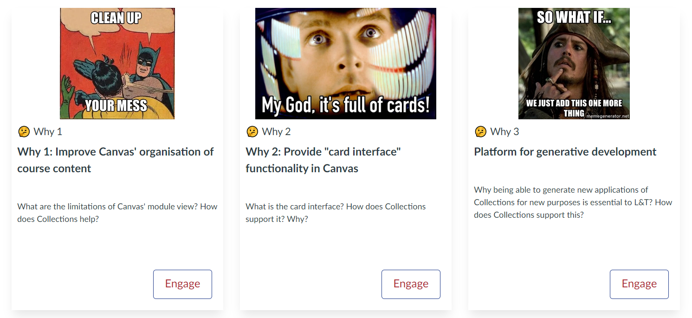
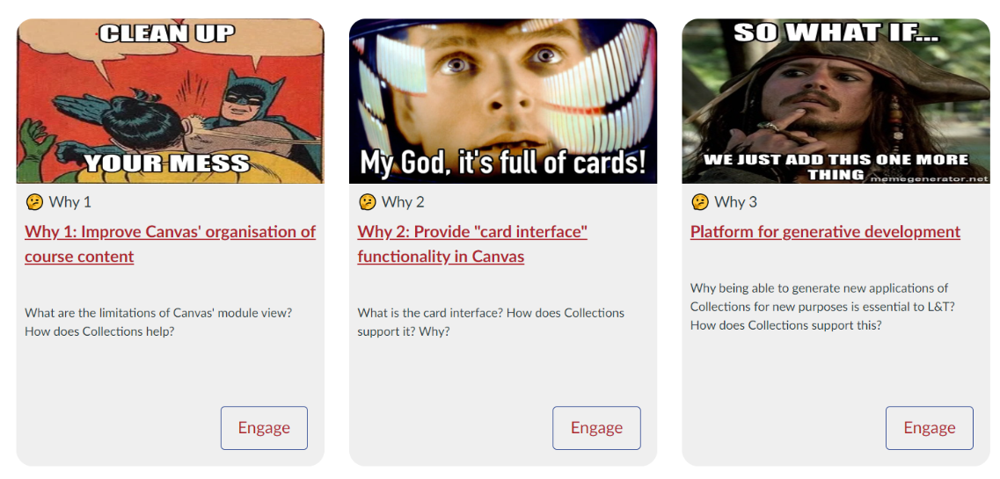

# Fix Claytons Card CSS - Scale images properly

## The Problem

For Card images to appear properly, they often need to be scaled. This works with the live version of Canvas Collections, but may not with the Claytons version. For example, the following images showing the same collection's representation, both live and Claytons.

In particular, note the scaling of the first and last images. In the live version they are much narrower due to the [aspect ratio](https://en.wikipedia.org/wiki/Aspect_ratio_(image)) of the image. In the Claytons version, the images are much wider.

| Live | Claytons |
| ---- | -------- |
|  |    | 


## The Cause

Claytons Collections writes HTML and CSS to a Canvas page. Canvas only allows certain types of HTML and CSS in the content of pages - specified in [this HTML Editor Allowlist](https://tr-learncanvas.s3.amazonaws.com/docs/Canvas_HTML_Editor_Allowlist.pdf). The CSS ```object-fit``` property - used to scale images - is actively removed by Canvas.

## One Fix - Design Plus

If you have access to [the Design Plus product](https://cidilabs.com/landing/design-tools/) available on your Canvas courses site it is possible to leverage Design Plus' [custom CSS](https://cidilabs.instructure.com/courses/776/pages/custom-css) feature to add the CSS ```object-fit``` property back.

> ⚠️ **Note:** Design Plus' custom CSS feature will not work on the Canvas Mobile app.

### 1. Generate the Claytons Collections page 

First, you will need [set up "Claytons"](../new/set-up-claytons.md) and update the page with Claytons Collections. The following image is from the _Why?_ page of the example course.

  

### 2. Update(/add) the ```css/style.css``` file 

As outlined in the Design Plus [Custom CSS page](https://cidilabs.instructure.com/courses/776/pages/custom-css) the custom css features works by adding the contents of a ```css/style.css``` file in the Canvas site's files area. The file will need to exist in your course site and include the content of [this Card styles file](https://raw.githubusercontent.com/djplaner/canvas-collections/main/src/Collections/Views/cardStyle.css).


### 3. Turn on the custom CSS feature

The custom CSS features needs to be turned on for each page. The vendor provides [this documentation for the process](https://cidilabs.instructure.com/courses/102/pages/custom-css?module_item_id=3372). The following animated image demonstrates.


### 4. Check the page

