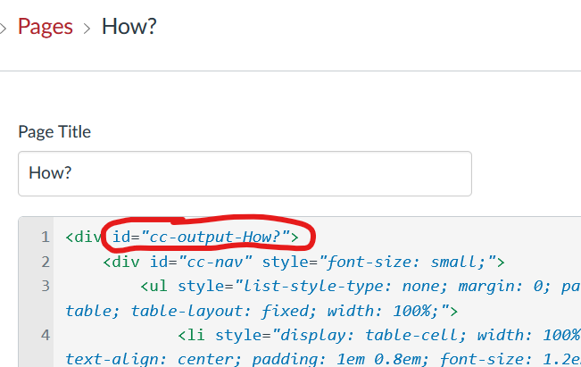
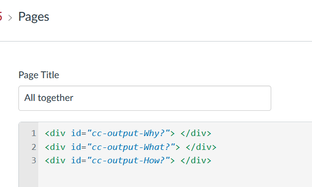
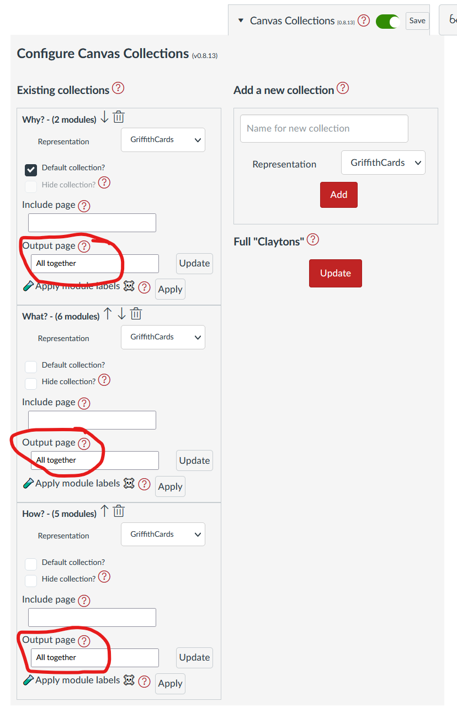
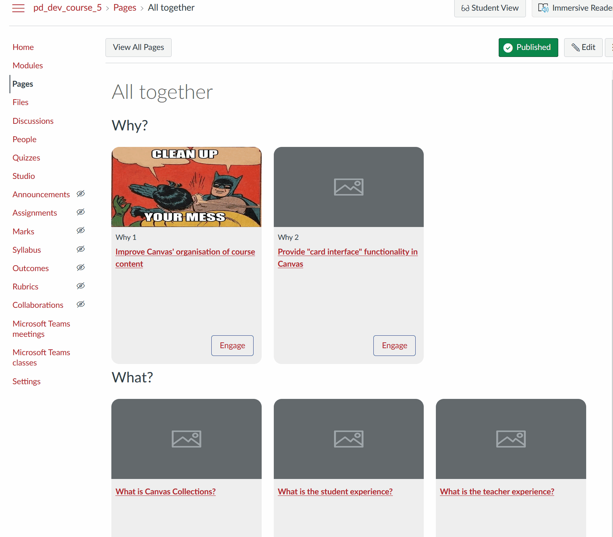
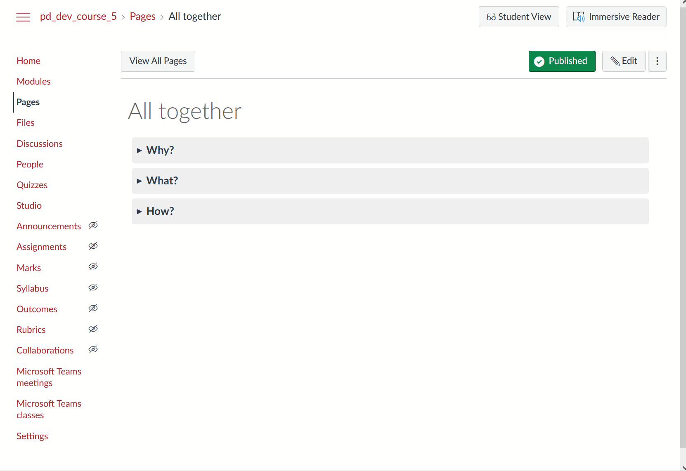

# Multi-collection, one page Claytons

Claytons Collections provides a way to create a Canvas page that contains a Collection's representation. It provides [two methods you can use](../new/set-up-claytons.md#use-collections-to-update-the-pages):

1. Update a single page using the _output page_
2. Update multiple pages using _Full Claytons_

Typically, this is used to place each collection's representation onto its own page. For example, the following animated image that shows the process of placing the representations for three collections (_Why?_, _What?_, and _How?_) onto three separate pages (with the same names).

The following shows how you can place the representations for these same three collections (_Why?_, _What?_, and _How?_) onto a single page.


## The Process

The process for doing this is almost the same as used on the [setting up Claytons Collections page](../new/set-up-claytons.md). 

1. Configure Canvas Collections
2. How many collections for Claytons?
3. 🆕 How many pages?
4. Create (or identify) the page(s) required.
5. Set up the page(s)
6. Specify the collection's output page
7. Use Collections to update the pages

Once the basics are setup, you can also [make it fancy](#make-it-fancy)

### Configure Canvas Collections

This only works if Collections is configured for your course. The example here will be using the same course and Collections configuration as [the previous example](../new/set-up-claytons.md#configure-canvas-collections).

### How many collections for Claytons?

As with [the previous example](../new/set-up-claytons.md#how-many-collections-for-claytons) the following will use all three available collections. You can choose as many as you like, but since the aim is to include the representations from multiple collections, you'll need at least two.

### 🆕 How many pages?

Previously, the example used a single page for each collection. This time, the example will use a single page for all three collections. 

If you're are using less than one page per per collection, you'll need to perform the "set up the page(s)" step below.

### Create (or identify) the page(s) required.

Currently, Collections will not create the pages for you. You'll need to be sure that all the required Canvas pages exist.

### Set up the page(s) - add each collection's output div

#### Background

When Claytons Collections updates a Canvas page it places the HTML for that collections' representation into a [HTML <div> tag](https://www.w3schools.com/tags/tag_div.ASP) - a common why to group related HTML. Apart from the HTML, the <div> tag also has an identifier unique to the collection and Claytons Collections. For example, the following image shows the HTML for the _How?_ page from [the previous example](../new/set-up-claytons.md) where the _How?_ page contained the representation for the _How?_ collection.

In the image, the <div> tag identifier has been circled in red ```<div id="cc-output-How?">```. The first part of the identifier is consistent ```cc-output-``` for Canvas Collections output. The last part of the identifier is the name of the collection ```How?```.

  

#### One div per collection

If you want to have the representation of more than one collection on a single page OR if you want to specify exactly where the representation is placed on the page, you'll need to add a <div> tag for each collection.

For this example, all three collections will be placed on a single page titled ```All together``` with the following order: _Why?_, _What?_, and _How?_. The following image shows the HTML for the ```All together``` page with the <div> tags and identifiers added.

  

### Specify the collection's output page

As with the previous example, the _output page_ for each collection needs to be specified. This time, the _output page_ for each collection will be the ```All together``` page. As illustrated in the following image.

  

### Use Collections to update the pages

There are two options that could be used to update the pages summarised in the following tabe.

| Method | Description | Features |
| --- | --- | --- |
: _update_ the output page | Click the _update_ button or each collection | Updates the page with just each collection's representation (no navigation bar) |
| _Full Claytons_ | Click the _Full Claytons_ and all collections with output pages will be updated | Adds both the collection's representation and a navigation bar |

> ❗️ **Note:** If placing multiple collections onto a single page, you probably do NOT want to use _Full Claytons_.

Hence the approach shown in the following animated image uses the _update_ output page option. The image shows that each collection can be updated and its results checked before proceeding.


### Make it fancy

With all this set up, you now have a Canvas page into which you can update the collections' representations. At the moment, the page just has each representation one after the other, you may want to make it a bit fancier than that by, for example

1. Adding a title for each collection.
2. Turning each collection into an accordion.

Or some other idea you can translate into HTML. 

#### Adding a title for each collection

All that's need to achieve this is to edit the _All together_ page and place appropriate headings between each collection's representation.



#### Put the collections into accordions

Or with another bit of fancy HTML you can make accordions.

