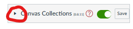
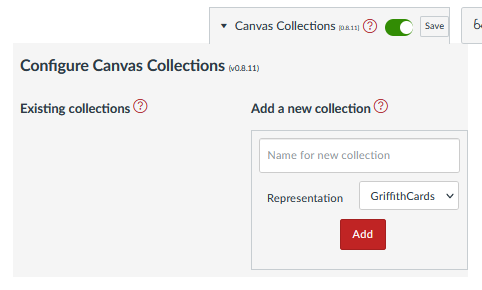
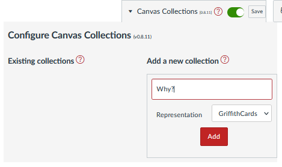
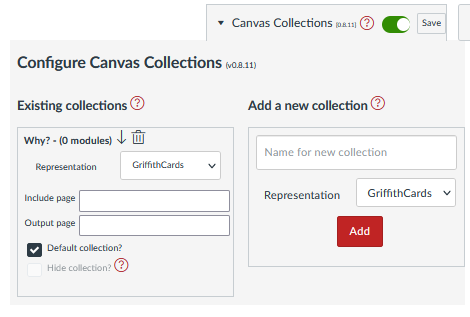
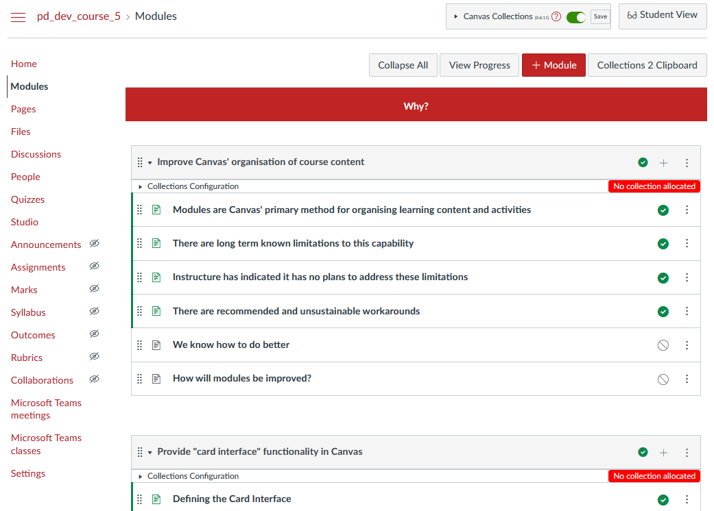
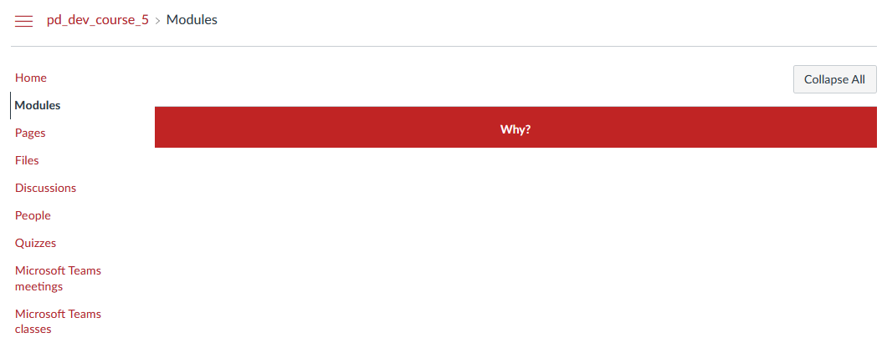
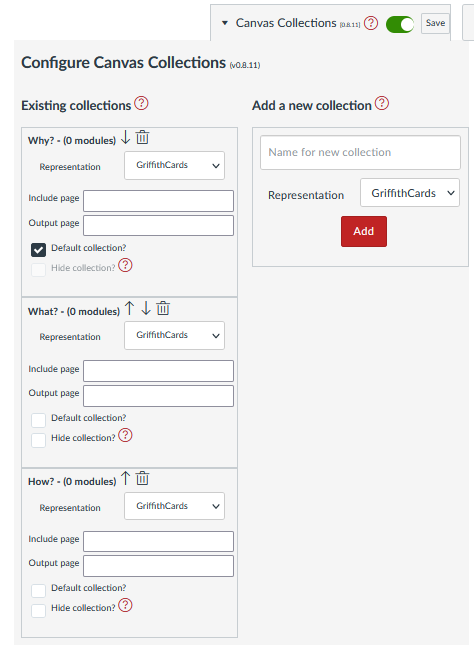
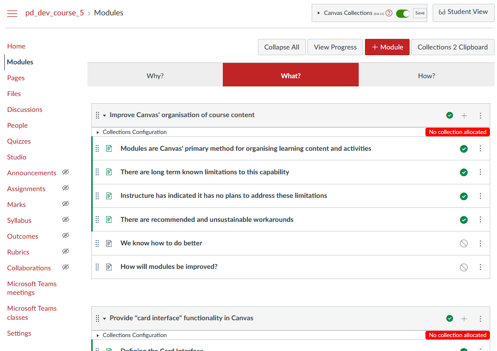

# Configure the collections for a new course

When starting with a new course, the first step in configuring Canvas Collections is to configure the course's collections. As outlined on the [design](design.md) page, the collections are the primary way to organise the course's modules and the sample course is intended to have three collections: Why? What? and How?.

## Go to the course's module view

Canvas Collections typically only works on a Canvas course site's Modules view. So the first step is to go to the Modules view.

## Turn on collections

Next, if Collections is turned off, click the Collections toggle to turn it on.

| Collections off | Collections on |
| --------------- | -------------- |
|  |  |

## Open the Collection Configuration area

With Collection's turned on, there will be a small arrow appearing near the Collections' toggle - see the following image. 

  

Clicking on that arrow will open the Collection Configuration area. As shown in the following image, Collection Configuration area has two main parts:

1. _Existing collections_; and,

    Will show the details of any existing collections (if there are any) and provide a way to edit, move, and delete them.
2. _Add a new collection_

    The simple form used to create a new collection for this course.

  

## Add the first collection

Adding a collection to a course involves completing the _Add a new collection_ form and hitting the **Add** button. To complete the form you need to be able to answer two questions

1. What will the collection's name be?

    The name will be visible to users and should be a short, descriptive, and unique name for the collection.
2. What will the collections's representation be?

    Which of [the available representations](../../reference/representations/overview.md) will be used to present the collection's modules to users.

The first collection of the sample course is titled _Why?_ and will use the standard _GriffithCards_ representation.

  

## Examine the change: existing collections 

Clicking the **Add** button in the above image will immediately update the _Existing Collections_ view of the Collection configuration area. With the details of the new collection visible.

  

## Examine the change: the Collections' navigation bar - for staff

Beyond the Collection configuration area, the most obvious change is the addition of a new navigation bar.  For staff, the will see the navigation bar and all other modules, whether they are published or not.

As can be seen by the _No collection allocated_ warnings under each module, at this stage we've only added a collection. We've not yet allocated any modules to that collection.

  

## Examine the change: navigation bar - for students

That no modules are allocated to collections creates a problem for students. If they are using Canvas Collections, they will only see the modules that are allocated to collections. Whether they are published or not. As illustrated by the "student view" of the course below.

| **NOTE:** This only applies if students are using collections. If you are using the [individual](../../getting-started/install/individual.md) version of Canvas Collections, only you can see the live changes.

  

## Add the remaining collections

Now the remaining collections can be added to the course using the Collection's configuration area, resulting in the following.

  

And a more complete navigation bar which can be used to navigate from collection to collection. However, this has no effect on the displayed modules because they have not yet be allocated to collections.

  

## What's next? Configuring the modules

[Configuring the modules](./configure-modules.md) includes allocation of modules to collections.
