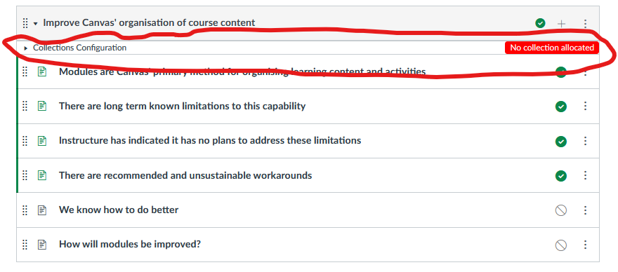
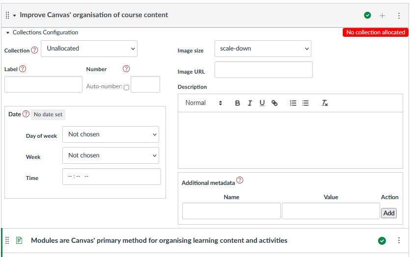
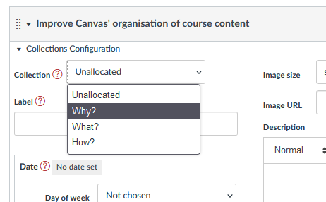
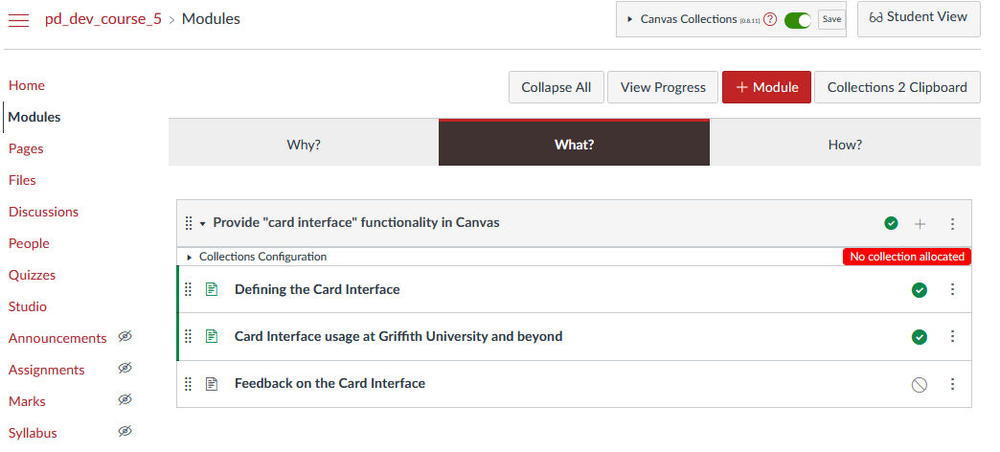
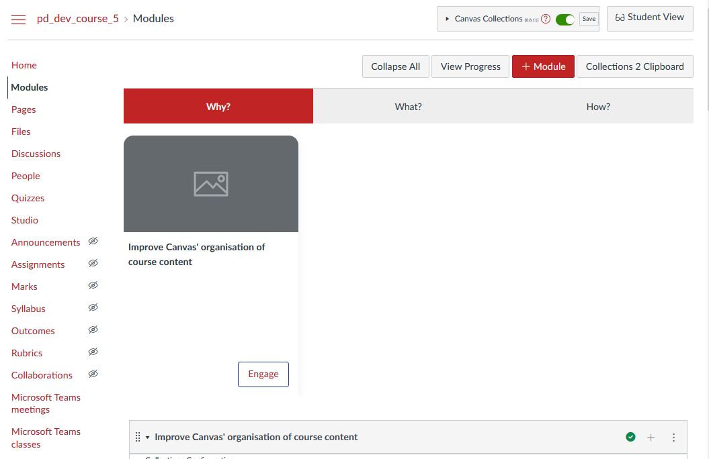
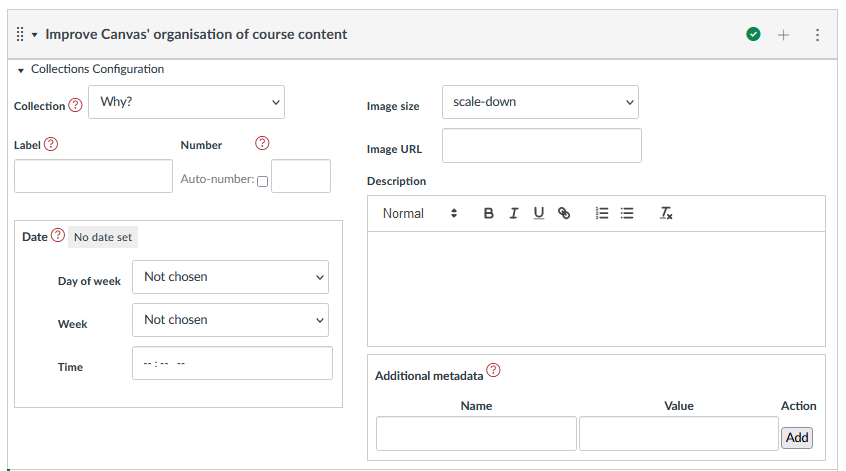

# Configure the modules

Having [designed our use of collections](./design.md) and [configured our collections](./configure-collections.md), we reach the last step - configuring the modules.

There are two parts to this step

1. Allocate the modules to a collection; and,

    Only modules that are allocated to a collection will be displayed.
  
2. Specify metadata.

    This additional information about each module is used by representations to modify how the module is displayed.

## Introducing the module configuration area

For teachers and designers, Canvas Collections adds a module specific configuration area to each Module. This is how you configure each module.

### Find the module configuration area

Each module's configuration area will be visible (to teachers and designers) just under the module title - circled in red below. By default the module configuration area is closed.

  

### Open the module configuration area

As with the Collections configuration area, you open the module configuration area by clicking on the small arrow. This will open the module configuration area and reveal the module's metadata.

The following image shows an early version of the module configuration area, currently the major areas of the module configuration area, includes:

- Collection - used to specify which collection the module belongs to.
- Label - three elements (label, auto-number, and number) used to specify the module's label and number.
- Date - specify the date for the module using three elements - day of week; week; and time.
- Image - associate an image with the module and how it should be scaled to fit with a card.
- Description - provide a short description or rationale for the module.
- Additional metadata - add and remove additional metadata in the form of name/value pairs.

Use these form elements to set and change the module configuration.

  

## Allocate the modules

The _Collections_ element will contain a list of the current collections. Use the menu to choose one.  When you change the collection allocation for a module, your view of Collections will change in a number of ways.

  

### Examine the change

#### Module only appears when its collection is current

For example, the _Improve Canvas' organisation of course content_ module was allocated to the _Why?_ collection.  It is not visible when viewing the _What?_ collection.

  

#### Module is is represented using the collection's representation

The _Why?_ collection was configured to use the _GriffithCards_ representation. Hence the newly allocated module is represented as a card - a rather bare card.

  

#### Module configuration area lists the allocated collection

The allocated module now shows _Why?_ as it's collection.

  

### Allocate the remaining modules

__placeholder__

## Specify additional metadata

### Add an image

### Add a description

### Add a label and a number

### Configure auto-number labels

### Configure a date
