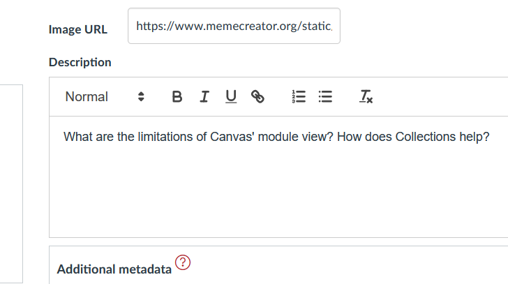
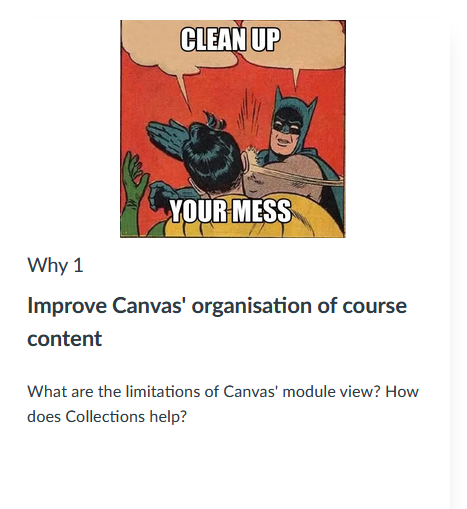
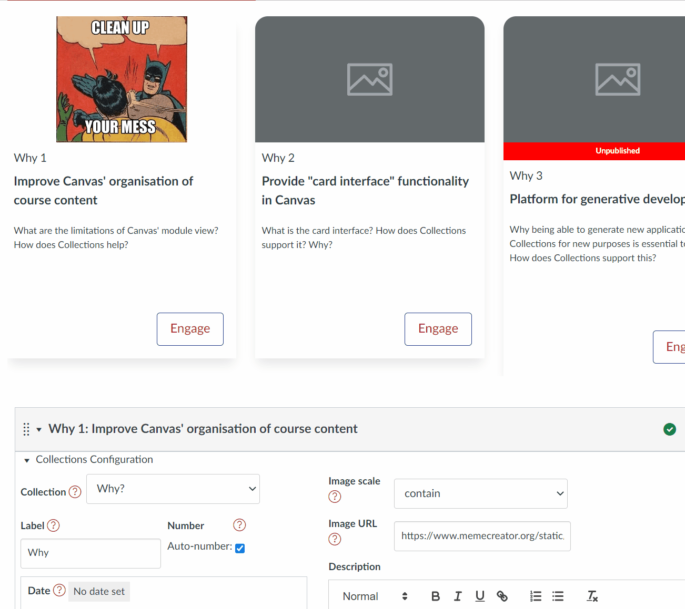

# Configure the modules

Having [designed our use of collections](./design.md) and [configured our collections](./configure-collections.md), we reach the last step - configuring the modules.

There are two parts to this step

1. Allocate the modules to a collection; and,

    Only modules that are allocated to a collection will be displayed.
  
2. Specify metadata.

    This additional information about each module is used by representations to modify how the module is displayed.

## Introducing the module configuration area

For teachers and designers, Canvas Collections adds a module specific configuration area to each Module. This is how you configure each module.

### Find the module configuration area

Each module's configuration area will be visible (to teachers and designers) just under the module title - circled in red below. By default the module configuration area is closed.

  

### Open the module configuration area

As with the Collections configuration area, you open the module configuration area by clicking on the small arrow. This will open the module configuration area and reveal the module's metadata.

The following image shows an early version of the module configuration area, currently the major areas of the module configuration area, includes:

- Collection - used to specify which collection the module belongs to.
- Label - three elements (label, auto-number, and number) used to specify the module's label and number.
- Date - specify the date for the module using three elements - day of week; week; and time.
- Image - associate an image with the module and how it should be scaled to fit with a card.
- Description - provide a short description or rationale for the module.
- Additional metadata - add and remove additional metadata in the form of name/value pairs.

Use these form elements to set and change the module configuration.

  

## Allocate the modules

The _Collections_ element will contain a list of the current collections. Use the menu to choose one.  When you change the collection allocation for a module, your view of Collections will change in a number of ways.

  

### Examine the change

#### Module only appears when its collection is current

For example, the _Improve Canvas' organisation of course content_ module was allocated to the _Why?_ collection.  It is not visible when viewing the _What?_ collection.

  

#### Module is represented using the collection's representation

The _Why?_ collection was configured to use the _GriffithCards_ representation. Hence the newly allocated module is represented as a card - a rather bare card.

  

#### Module configuration area lists the allocated collection

The allocated module now shows _Why?_ as it's collection.

  

### Allocate the remaining modules

Once all the modules are allocated to collections, the Collections configuration _Existing collections_ section looks like the following: 3 modules in _Why?_; 5 modules in _What?_; and, 5 modules in _How?_.

  

The following animated image shows the rest of the interface once all modules are allocated to collections. Some points to note

- Some modules remain _unpublished_.

    The cards representation adds a warning (visible to teachers and designers) identifying unpublished modules. These will not be visible to students.

- Navigation between the three collections works as expected.
- Clicking on the _Engage_ button on a Card brings that module to focus.
- The cards are all relatively blank with limited metadata (e.g. images, descriptions etc)

Time to add some additional metadata.

## Specify additional metadata

As mentioned above, the additional metadata that can be added includes the following list. Each with its own form elements. The following walk-through gives an example of each.

> *Note:* As soon as metadata is changed, the module's representation will be updated.

| Metadata | Description |
| --- | --- | --- |
| Description | Some HTML intended to provide students with a description or rationale for the object represented by the module |
| Image | A visual image to represent the module | 
| Label & Number | Explicitly identify a module as a particular object (the label) and its position in the collection (the number - which can be auto calculated) | 
| Date & Date Label | Specify the day/time when the activity occurs, is due etc. Through a combination of a date and a label (e.g. due, commencing etc) | 
| Additional metadata | A flexible method for specifying any additional metadata in the form of pairs of name and value | 

### Add a description

The description is best used to provide students with additional information about what, why and how they might engage with the activities and information contained by a module. The description is a relative short piece of text entered using a simple visual editor under the description heading of the module configuration area.

| Entry | Representation |
| --- | --- |
|  |    |

### Add an image

The ability to add an image to each module is a powerful way to improve the visual design of ca course and help student way finding by providing a strong, unique a visual representation of the module. 

Collections uses two pieces of metadata to specify the image and how it is displayed:

1. The _Image URL_ - the web location where the image can be viewed by users of the Canvas course site (e.g. typically the files area of the course site, or on the open web)
2. The _Image scale_ - how the image is scaled to fit within the available space - possibilities are outlined in the following table.

#### Image scale

Image scale is implemented and constrained by a standard [CSS property called _object-fit_](https://www.w3schools.com/cssref/css3_pr_object-fit.asp). The following table outlines the possible values for _object-fit_ that appear in the _Image scale_ drop down in Collections. The animated image below demonstrates how different values affect the display of the image.

| Value | Description |
| --- | --- |
| `cover` | The image is scaled to fit the available space, maintaining the aspect ratio. The image is cropped to fit the available space. |
| `contain` | The image is scaled to fit the available space, maintaining the aspect ratio. The image is not cropped. |
| `fill` | The image is scaled to fill the available space, maintaining the aspect ratio. The image is cropped to fit the available space. |
| `fit` | The image is scaled to fit the available space, maintaining the aspect ratio. The image is not cropped. |
| `none` | The image is not scaled. |
| `scale-down` | The image is scaled to fit the available space, maintaining the aspect ratio. The image is not cropped. |

### Add a label and a number

### Configure auto-number labels

### Add a date and date label

### Configure a module for the assessment table representation