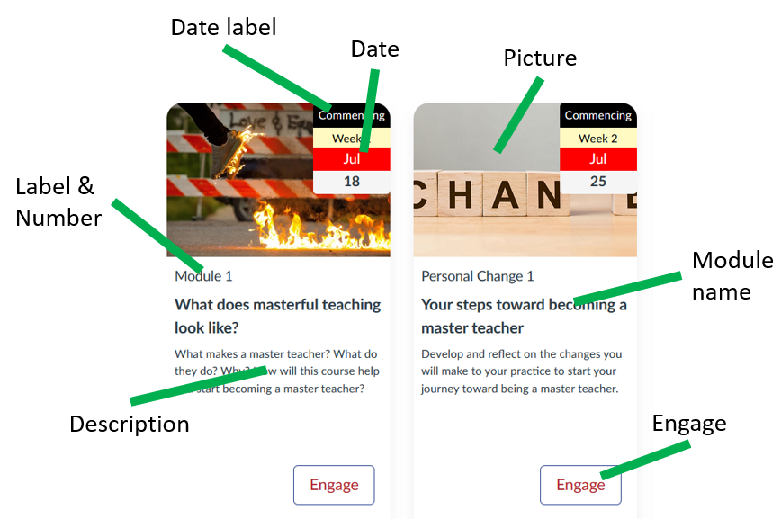

# Designing the use of Canvas Collections

Canvas Collections is designed to improve the information architecture of your course site's Modules view. To embed more explicitly a design that helps your students understand and navigate your course's modules. For this reason, the true success of Canvas Collections will arise from the quality of your design. 

## Leverage Collections' features

In particular, how well your design leverages the [features of Canvas Collections](../../features.md), in particular _Collections_ and _Objects/Activities_. These are the features that help integrate more context and design specific information into your course sites Modules view.

## Three sample questions

This page illustrates how the following questions can guide your design. Actual design will likely be more involved and iterative.

The questions are:

1. What collections will you use to group modules?
2. What type of objects/activities does each module represent?
3. What are the relevant metadata for each module?

## What collections will you use to group modules?

The following table summarises the existing modules in the sample course.

As is evident from the module names, this course has a very practical focus. Helping people understand and use Canvas Collections. Hence there was some focus on designing the course to answer common practical questions people might have. Practical questions that are typically grouped into three big questions:

1. Why should we both with Canvas Collections?
2. What is Canvas Collections?
3. How do I and my students use Canvas Collections?

Which translates very nicely into three collections:

1. Why?
2. What?
3. How?

| Module | Description | Collection |
| --- | --- | --- |
| Improve Canvas' organisation of course content | Explain the problem collections solves | Why? |
| Provide "card interface" functionality in Canvas | Explain one of the benefits | Why? |
| Platform for generative development | Explain a more esoteric benefit | Why? |
| What is Canvas Collections? | Describe what it is | What? |
| What is the student experience? | Describe the student experience | What? |
| What is the teacher experience? | Describe the teacher experience | What? |
| What functionality is provided? | Overview of collection's functionality | What? |
| How does Canvas Collections work? | Describe how it works | How? |
| How do you install Canvas Collections? | Describe how to install it | How? |
| How do you configure Canvas Collections (edit the config file)? | Describe the most primitive (and deprecated) way to configure it | How? |
| How do you configure Canvas Collections? | Describe the new way to configure it | How? |
| How do you design a Blackboard course migration? | How to migrate the Card Interface from Blackboard to Collections | How? |
| An example unpublished module | Demonstrate how an unpublished module is represented | How? |

## What type of objects/activities does each module represent?

Canvas modules are likely not essential objects for your students to use, beyond as a means to represent and access the learning content and activities in your course. Are you really going to be telling your students to go to the second Canvas Module for an activity, or are you likely to say go to the second topic, theme, week or some other type of design and context specific object.

The type of object or activity that each Canvas module is used to represent will have different attributes. Making those attributes explicit to students via Canvas Collections is one way to improve the usability of your course site and their engagement with the design.

### The example course

The example course is not a typical formal university course. It doesn't have weeks, lectures, topics. Rather it aims to support self-paced information access. 
As stated above the design has arrived at three broad driving questions as a way to organise the modules: Why?, What?, and How?. Which has led to the following design decision about the types of objects represented by each module

| Collection  |	Type of object |
| --- | --- |
| Why?| 	Reason | 
| What?| 	Answer | 
| How?| 	Process | 

## What are the relevant metadata for each module?

The following table summarises the metadata currently supported by Canvas Collections and a description of current common uses. The image after that table provides a visual representation of how the metadata is used in the Cards representation.

### How to use this in design?

This metadata can be used to specify additional attributes for a module. These additional attributes can help make more explicit what the purpose of the module is, or what type of object it is meant to be. For example, an Canvas module that is representing information about an assignment would normally have an explicit due date.

#### The example course

| Metadata |	Design intent |
| --- | --- |
| Label & Number |	As identified above, each collection's module represents a different type of object. The label metadata element will be used to explicitly label each module with the type of object. The auto number feature will be used to automatically generate a sequence of numbers. This enables the use of language such as "Have a look at Answer #2 in the What? collection for an idea of what the student experience is like"
| Description |	While the module titles will be used to sign post what a visitor will get out of a module. The module descriptions will be used to supplement this.
| Banner Image |	Learning how to use collections is not the most exciting topic in the world. To lighten the mood a bit each module will be represented by a (slightly) relevant meme.

### Available metadata

The _Configure Modules_ page provides examples of [specifying additional metadata](./configure-modules.md#specifying-additional-metadata) for a module.

| Metadata | Description | Example |
| --- | --- | --- |
| Collection | The collection the module belongs to | [Allocate modules](./configure-modules.md#allocate-the-modules) as per your design | 
| Description | Some HTML intended to provide students with a description or rationale for the object represented by the module | e.g. a synopsis or a [driving question](https://www.magnifylearningin.org/driving-questions) |
| Image | A visual image to represent the module | Most commonly used with the Cards representation (e.g. [add an image](./configure-modules.md#add-an-image)) |
| Label & Number | Explicitly identify a module as a particular object (the label) and its position in the collection (the number - which can be auto calculated) | _Lecture 1_, _Topic 5_, _Workshop_ are [some examples](./configure-modules.md#add-a-label-and-number) |
| Date & Date Label | Specify the day/time when the activity occurs, is due etc. Through a combination of a date and a label (e.g. due, commencing etc) | _Due Week 1 May 5_ or _Happening 5pm Fri Week 1 May 9_ are [some examples](./configure-modules.md#add-a-date-and-date-label) |
| Additional metadata | A flexible method for specifying any additional metadata in the form of pairs of name and value | The _AssessmentTable_ representation can use additional meta data with the names _learning outcomes_ and _weighting_ |

  

### Reusing metadata in different representations

Collections can use different representations to change visual appearance. For example, the following image (_AssessmentTable_ representation) is the same collection (partially) shown in the above image (_GriffithCards_ representation). It illustrates how a different representation reuses some metadata (description and date) and ignores other metadata (image, engage). It also shows how _additional metadata_ (e.g. _learning outcomes_ and _weighting_ can be used in one representation (assessment table) but ignored in another (Griffith Cards).

  

### Adding different metadata - please suggest

This support will continue to be expanded over time. In particular, in response to your suggestions. One way to make a suggestion is to [raise an issue describing the suggestion](https://github.com/djplaner/canvas-collections/issues/new) on the Collections repository. 