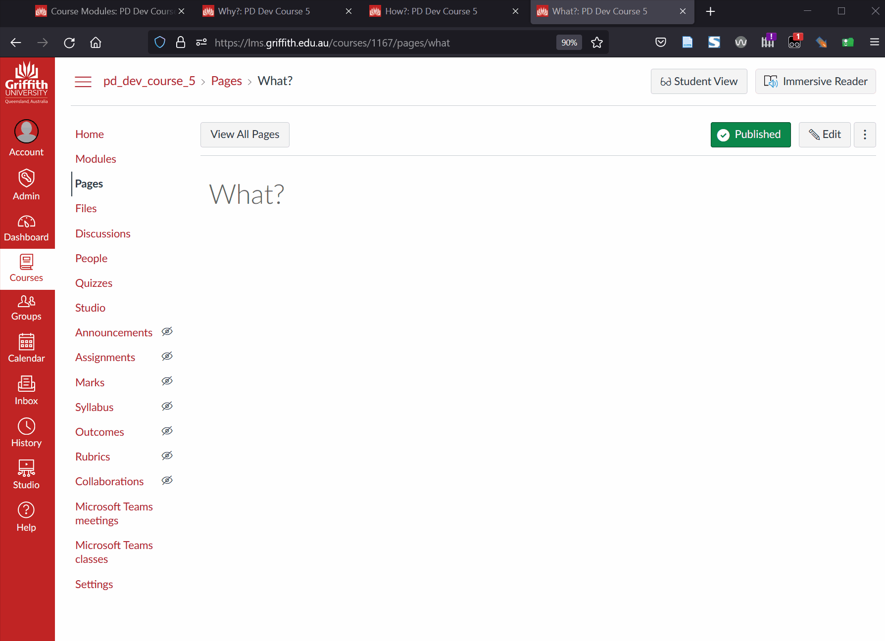

# Setting up Claytons Collections

[Claytons Collections](../../getting-started/use/claytons.md) is a way of using Canvas Collections to create and maintain a Canvas Page (e.g. advice such as [creating an inviting home page](https://community.canvaslms.com/t5/Canvas-Instructional-Designer/Creating-an-inviting-course-home-page/ba-p/267236)). It is a way to use [Collections' features](../../features.md) without students and others having access to Collections.

Setting up Claytons Collections involves the following steps:

1. Configure Canvas Collections for your course site.
2. Decide how many Collections you'll configure with Claytons.
3. Create a Canvas page for each Collection.
4. Specify the collection's output page.
5. Use Collections to update the pages.

The last step is one you repeat every time you make a change to Collections.

## Configure Canvas Collections

The [Configure Collections walk through](./configure-collections.md) steps through this process. This example will use the Canvas course configured in that walk through an pictured below. It has three collections: _Why?_, _What?_, and _How?_.

  

## How many collections for Claytons?

Claytons Collections is simply a method of copying the representation of a single Collection (e.g. _Why?_) to a matching Canvas page. Hence, an early decisions is how many and which of your course's collections you wish to use with Claytons.

In this example, all three will be used.

## Create (or identify) a Canvas page for each Collection

Since Claytons copies a representation of a collection to a Canvas page, each collection needs a matching Canvas page. Use the standard process for [creating a Canvas page](https://community.canvaslms.com/t5/Instructor-Guide/How-do-I-create-a-new-page-in-a-course/ta-p/1031). 

Use any name you like for each page, common advice would include:

- Using the same name as the collection will reinforce the information architecture and possibly minimise confusion.
- If you wish students to see the page, it will need to be published.
- Using existing pages is fine.

    Collections will not overwrite any existing content on the page. By default it will add the collections' representation to the bottom of the page.

The following image shows that this advice as been followed. There are three new pages, each matching the three collections in the example. Each page has been published.

  

## Specify the collection's output page 

This step links a collection to the page that was just created, enabling it be updated.

It is done using the Collections configuration dialog and requires that you enter the name of the appropriate page as the _Output Page_. for a collection.

The following image shows progress in specifying the output pages for the example course. The _Output page_ sections have been circled in red. The _Why?_ collection has had its output page specified and there is a matching _Update_ button. The _What?_ collection has had its output page entered, but not yet finished. This is why there is no _Update_ button.

  

## Use Collections to update the pages

There are two methods for updating the pages:

1. Update the _output page_ for a single collection; or,
2. Full "Claytons".

### Update the output page

Used to update a single collection's output page.  Will not include the collection's navigation bar. Is done by clicking the _Update_ button next to a collection's _Output page_. 

### Full "Claytons"

The "Full Claytons" differs from "update" in two ways:

1. All _output pages_ are updated.
2. Each _output page_ will contain the collection's representation **AND** a navigation bar that enables navigation between the pages.

"Full Claytons" has its own _Update_ button in the Collections configuration dialog. Click this and Collections will update each page in turn. 

The following image looks at each individual page before applying "Full Claytons". Showing the pages don't have any content. It then shows the process of applying "Full Claytons". Then it revisits one of the pages and reloads the page to see the updated content. The navigation bar - added by "Full Claytons" - is then used to navigate to the other pages.

