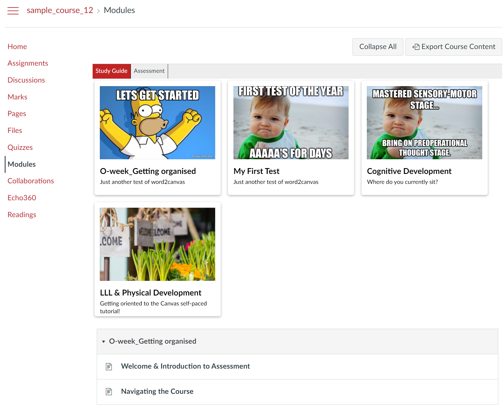
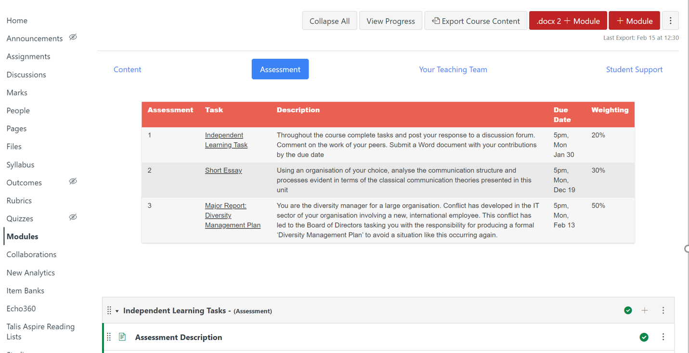

# canvas-collections

Improve the functionality of [Canvas LMS](https://www.instructure.com/en-au/canvas) Modules by enabling:
1. Grouping modules into collections; and,
2. Flexible and enhanced representations.

**Note:** :warning: This project is currently in the early stages of development :construction:. It is known to work as both a userscript and injected into a Canvas instance. Currently, canvas-collections will
- Add default cards on the module page of any Canvas course.
- Add specific cards and collections to Canvas courses using hard-coded configuration.

## Why?

Two address two known limitiations of [the vanilla Canvas Modules page](https://community.canvaslms.com/t5/Canvas-Basics-Guide/What-are-Modules/ta-p/6):
1.  [no way to group modules](https://community.canvaslms.com/t5/Canvas-Question-Forum/Is-there-a-way-to-group-modules-together/m-p/179756/highlight/true#M84951); and,

    For a course with large numbers of modules or which uses modules for very different purposes the inability to group modules is a problem. Available workarounds all [have their limitations](https://community.canvaslms.com/t5/Canvas-Question-Forum/Is-there-a-way-to-group-modules-together/m-p/179757/highlight/true#M84952) and Instructure ["don't have plans to support nested modules soon"](https://community.canvaslms.com/t5/Idea-Conversations/Modules-within-Modules/idc-p/461383/highlight/true#M50428).
2.  [a very linear, less than engaging presentation](https://learntech.medsci.ox.ac.uk/wordpress-blog/a-dashboard-view-of-modules-in-canvas/).

    The linear "modules uncollapsed" by default approach causes issues (scroll of death) for courses [with "many modules and module items"](https://community.canvaslms.com/t5/Idea-Conversations/Modules-Display-as-Collapsed-by-Default/idi-p/370135). It's not kept up with more contemporary web design. e.g. [Card-Based User Interfaces](https://www.smashingmagazine.com/2016/10/designing-card-based-user-interfaces/) which [hundreds of courses across the world](https://djon.es/blog/2021/03/12/reflecting-on-the-spread-of-the-card-interface-for-blackboard-learn/) have found useful in Blackboard using the [Card Interface tweak](https://github.com/djplaner/Card-Interface-Tweak) and which [at least a couple of institutions](https://learntech.medsci.ox.ac.uk/wordpress-blog/a-dashboard-view-of-modules-in-canvas/) have sought to add to the Modules page. 

## What?

Embedded in Canvas, the canvas-collections Javascript aims to provide two additional functions to the standard Canvas Modules page:
1. Enable modules to be grouped into _Collections_; and,
2. Allow collections to use different _Representations_.

### Collections

Modules are the standard Canvas way to organise sequences of information. Modules can be designed for different purposes (e.g. content, assessment, resources, etc.). Canvas groups all modules on the same page. Allowing no distinction. Resulting in the modules page containing a long list of modules for different purposes. Decreasing findability.

canvas-collections will allow modules to be grouped into different _collections_ as fits the design of the course. A navigation interface will allow the learner to navigate between different collections of modules. Only the modules for the selected collection will be visible. For example, the following image shows a Canvas course modules page with two collections: _Study Guide_ and _Assessment_. _Study Guide_ is the currently selected collection and hence only modules in that collection are visible.

### Representations

The standard Canvas modules page shows a list of every module. This is [known to be problematic](https://community.canvaslms.com/t5/Idea-Conversations/Modules-Display-as-Collapsed-by-Default/idi-p/370135) where there are numerous modules. Gaining and understanding of the available modules and navigating between them becomes overwhelming. This has led many teachers to designing their own solutions.

canvas-collections will automatically generate different representations for modules. Whether all of the modules or just the modules in a particular collection. The initial representation will be a card-based representation. A representation illustrated in the image above. 

Each module is represented by a card that can be customised to represent the module and its purpose. The module cards are inserted before the standard Canvas module list. Clicking on a card will take you to the module. Eventually, the cards will support much of [the functionality of the Card Interface](https://www.smashingmagazine.com/2016/10/designing-card-based-user-interfaces/) and new Canvas specific functionality.

The following image illustrates a table-based representation. This is the next planned representation.

## Status

> :warning: canvas-collections is still under development. Not yet ready for significant use.

You can use canvas-collection in two ways:

1. Individually, as a [userscript](https://en.wikipedia.org/wiki/User_script). 
  Used for development and experimentation. You run canvas-collections in your web browser and it only impacts what you see. See the [install as userscript page](./docs/install_userscript.md) for how.
2. Institutionally, by including it in Canvas.
  If you wanted to use canvas-collections in production (not currently recommended). You us [the Canvas theme editor]() to include the canvas-collections Javascript (either the [minimised](https://raw.githubusercontent.com/djplaner/canvas-collections/main/release/canvas-collections.min.js) or [unminimised](https://raw.githubusercontent.com/djplaner/canvas-collections/main/release/canvas-collections.js) versions) in your Canvas instance.

### Additional Screenshots

Click on the screenshots to see larger versions.

| Default              | Additional configuration |
:---------------------:|:------------------------:
 | 

#### About _Default_

The _Default_ screenshot illustrates canvas-collections working on a standard Canvas modules page. No additional configuration. It is showing the modules page from an instance of the [Growing with Canvas](https://uc.instructure.com/courses/1032076) course. It illustrates early representations of standard Canvas functionality, including:
- Module requirements progress

    Individual Module items can have [completion requirements](https://community.canvaslms.com/t5/Instructor-Guide/How-do-I-add-requirements-to-a-module/ta-p/1131). If added, canvas-collections adds a circular progress bar to the module card illustrating the percentage of requirements completed.
- Module status

    The combination of [module pre-requisites and requirements](https://ki.instructure.com/courses/192/pages/locking-material-with-requirements-and-prerequisites) combine to indicate whether a module is completed, in progress, locked or....

#### About _Additional configuration_

The _Additional configuration_ screenshot is from a course where additional configuration has provided further information about the modules, including:
- Which collection a module belongs to

    Four are defined: Learning Journey; Assessment Essentials; Online Workshops; and, Student Support. _Learning Journey_ is currently displayed. The navigation bar above the cards allow navigation to other collections. Only modules belonging to the current collection are visible.
- Module date information
- Module label

    Modules within collections can be further distinguished by labels. e.g. the _Welcome_ module has no label. The _Introduction_ module is labelled _Topic 1_.
- Module description

    To aid learners in understanding the why and what of a module a short description is added to each module.

## Related work

- [Towards a Modules navigation menu in Instructure Canvas](https://learntech.medsci.ox.ac.uk/wordpress-blog/towards-a-navigation-menu-in-instructure-canvas/) - [github](https://gist.github.com/theotherdy/7983b4d64a2f376ee140673926ca5c07#file-ou-canvas-menu-demo-js)

    Creates a right-hand menu to support navigation within Modules
- [A dashboard view of Modules in Canvas v2](https://learntech.medsci.ox.ac.uk/wordpress-blog/a-dashboard-view-of-modules-in-canvas-v2/) - [github](https://github.com/msdlt/canvas-module-tiles/blob/master/canvas-module-tiles.js)
- [Canvas unpublish hack](https://daveeargle.com/2019/10/25/canvas-unpublish-hack/)

    Small blog post outlining a bit of JS to solve an issue with Canvas. Useful as an example of promises etc.
- [Module Ids with JS](https://community.canvaslms.com/t5/Canvas-Question-Forum/Module-ID-s-using-javascript/td-p/224060)

    Canvas community post that includes small JS code example using promises etc.
- [Canvas where am i](https://github.com/msdlt/canvas-where-am-I)

    Does a range of different and neat tweaks
    - tiles have a drop down box with details of each item (and perhaps a direct link)
    - adds module/item information to the left hand menu
    - adds progress icons to the previous/next
- [Collapse all modules](https://community.canvaslms.com/t5/Canvas-Developers-Group/Collapse-Expand-Modules/ba-p/273122) thread on instructure community around some code shared by an Instructure employee that helps manage collapse all modules
- [Module filters](https://community.canvaslms.com/t5/Canvas-Developers-Group/Module-Filters/ba-p/278855) - [blog post](https://lyonsinbeta.com/2019/6/experiments-in-product) - JS (from [another instructure employee](https://lyonsinbeta.com/)) to filter items on Modules page. Has some discussion about adding this type of functionality. [github](https://github.com/lyonsinbeta/canvas-module-filters). Doesn't appear to worry/handle dynamic loading of Module cotent
- [Quick Module Navigation](https://community.canvaslms.com/t5/Canvas-Admin-Blog/Quick-Module-Navigation/ba-p/279697) - JS to enable click on button (on home page) to go directly to appropriate module with other modules collapsed