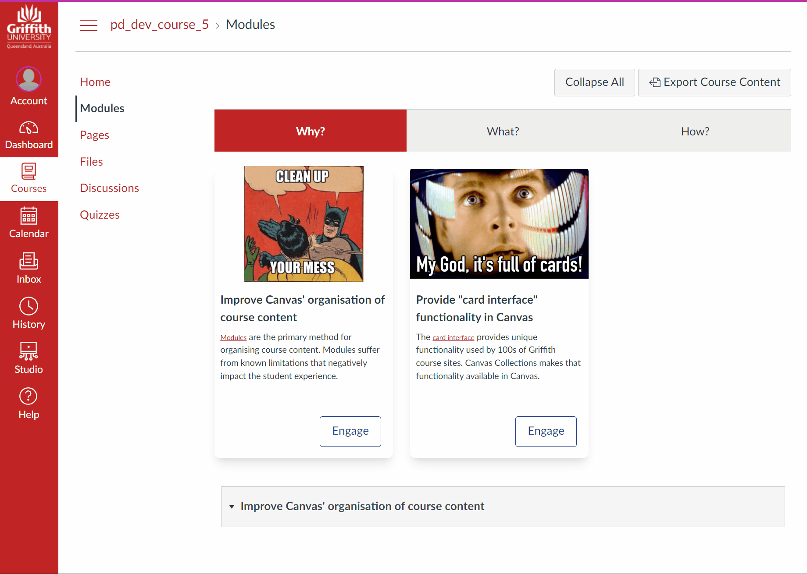

# Canvas Collections 

:confetti_ball: Version 1.1.0 - the first really usable version of Collections - is now available. See the [Collections site](https://djplaner.github.io/canvas-collections/) more for details  :confetti_ball:

Canvas Collections helps improve course site designs for the [Canvas LMS](https://canvaslms.instructure.com/lp/lms/) by transforming the [Canvas Modules page](https://www.instructure.com/en-au/resources/blog/how-use-modules-build-courses-canvas). 

## What can it do?

Collections allows you to add more structure, visuals, and context to your Canvas Modules page. This table provides more detail.

| Feature | Why? | How? | 
| --- | --- | --- | 
| [Structure](https://djplaner.github.io/canvas-collections/#structure) | Move beyond the ["..design nightmare (of)...one big list"](https://community.canvaslms.com/t5/Idea-Conversations/More-editing-functions/idc-p/475281/highlight/true#M53223) | Organise modules into [different collections](https://djplaner.github.io/canvas-collections/getting-started/101/concepts/#collections). Navigate between different collections only seeing relevant modules. |
| [Visuals](https://djplaner.github.io/canvas-collections/#visuals) | Move beyond visuals reminiscent of ["a chain of folders circa Windows 95"](https://community.canvaslms.com/t5/Canvas-Question-Forum/Visual-based-Module-Outline-PLEASE/m-p/395779/highlight/true#M140332) | Select a different [representation](https://djplaner.github.io/canvas-collections/getting-started/101/concepts/#representations) for each collection. Change at any time. Develop new purpose-built representations. |
| [Context](https://djplaner.github.io/canvas-collections/#context) | Add more context to modules (e.g. ["connective text"](https://community.canvaslms.com/t5/Canvas-Question-Forum/Is-there-a-way-to-add-connective-text-not-quot-text-headers-quot/m-p/510878), ["instructions or a greeting"](https://community.canvaslms.com/t5/Canvas-Ideas/Modules-Add-Images-to-Modules/idc-p/372263/highlight/true#M9258) etc) | Add [(meta-)data](https://djplaner.github.io/canvas-collections/getting-started/101/concepts/#context-objects-through-metadata) to each module. Add an [include page](https://djplaner.github.io/canvas-collections/reference/conceptual-model/collections/existing-collections/#include-page) to each collection. |

## What does Canvas Collections look like?

The images below are of the same course. The left hand image is the vanilla Canvas modules page. The right hand image is the same modules page with Canvas Collections configured.

This course was designed using three driving questions. Can you tell what those questions are from the vanilla Canvas page?  What about the Canvas Collections modules page?

| Vanilla Canvas | Canvas Collections |
| -------------- | ------------------ |
| [View full-size image](docs/assets/vanillaModules.gif) | [View full-size image](docs/assets/withCanvasCollections.gif) |
|  |  |

### Live (dynamic) Collections versus "Claytons" (static) Collections

The right-hand image above demonstrates live (aka dynamic) Canvas Collections. i.e. Canvas Collections is dynamically modifying the Canvas modules page as you interact with it. Live Collections only works if the Collections code is installed (typically by an institution) into Canvas (see ['How do I install Canvas Collections?](#how-do-i-install-canvas-collections)).

Canvas Collections can be used in ["Claytons" Collections mode](https://djplaner.github.io/canvas-collections/reference/conceptual-model/representations/claytons/overview/). 

## How do I install Canvas Collections?

There are two different ways to [install Canvas Collections](https://djplaner.github.io/canvas-collections/getting-started/install/how-to-install/).

| | Individual | Institutional |
| --- | --- | --- |
| Purpose | 
For teachers/designers to experiment with Collections.

Possibly also to create visual home/landing pages for use without Collections.
 | 
For institutions to make Canvas Collections available to all teachers/designers.
 |
| How | Install the Canvas Collections userscript into your browser. | An institution's Canvas administrator installs it into Canvas using [the Theme Editor](https://community.canvaslms.com/t5/Video-Guide/Theme-Editor-Admins/ta-p/383021) |
| | [Install "individual" Collections ](https://djplaner.github.io/canvas-collections/getting-started/install/individual/) | [Install "institutional" Collections ](https://djplaner.github.io/canvas-collections/getting-started/install/institutional/)  |

## Development

See [the development section](https://djplaner.github.io/canvas-collections/reference/development/development-overview/) of the Collections documentation site for more detail.